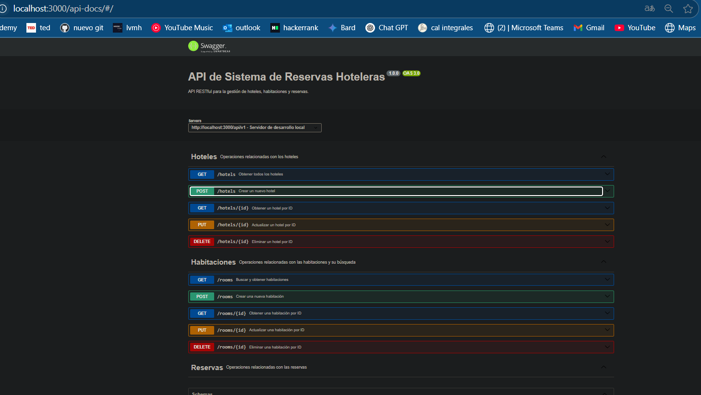

## Evidencias de Endpoints y Funcionalidades de Hoteles y rooms

### Crear un Hotel

### Crear una Habitación

### Actualizar un Hotel

### Actualizar una Habitación

### Eliminar un Hotel

### Eliminar una Habitación

### Obtener Todos los Hoteles

### Obtener un Hotel por ID

### Tambien se cuenta con la version en swagger

Estos estarian en api-docs.json
### Tambien la coleccion de postman
Progra 5.postman_collection.json